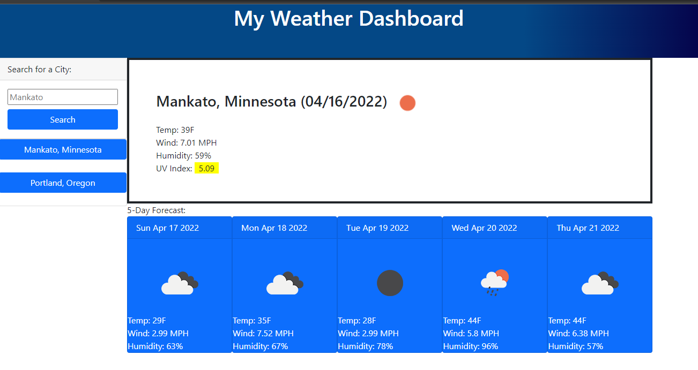

# My Weather Dashboard

Languages and tool used for this project:

### Screeen shot

### Links
***
GitHub Repository: <https://github.com/Wizzle13/my-weather-dashboard>

GitHub URL: <https://wizzle13.github.io/my-weather-dashboard/>